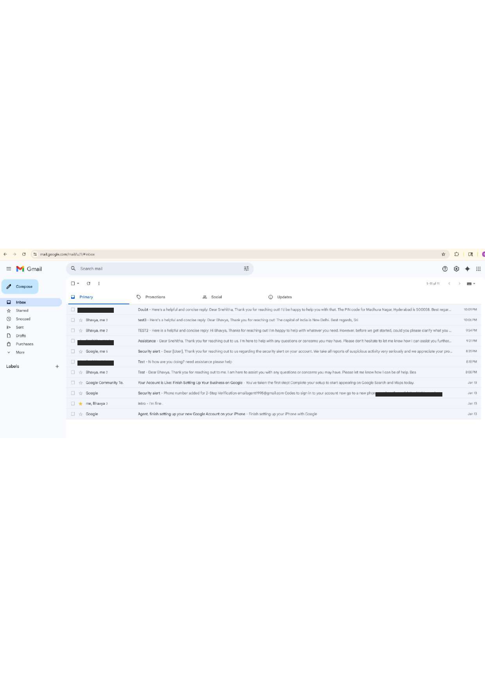
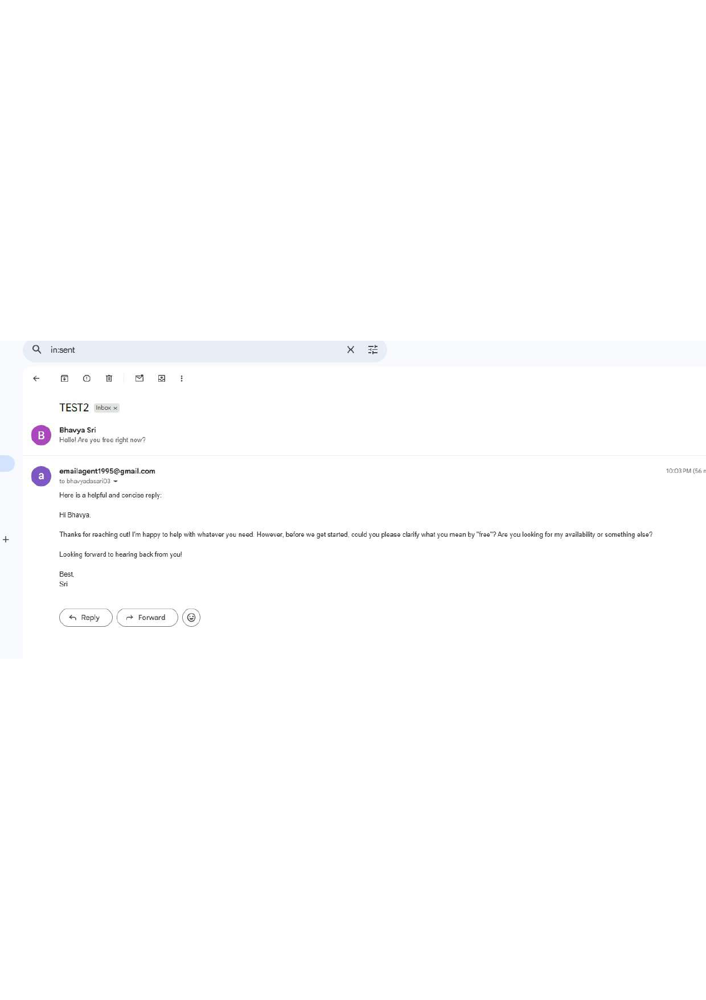
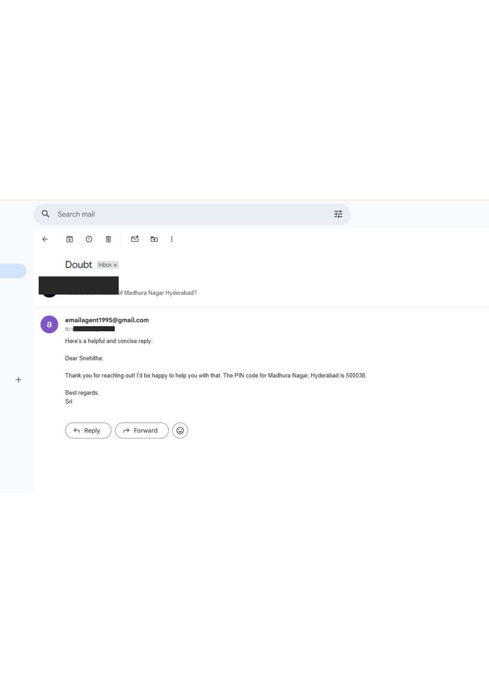
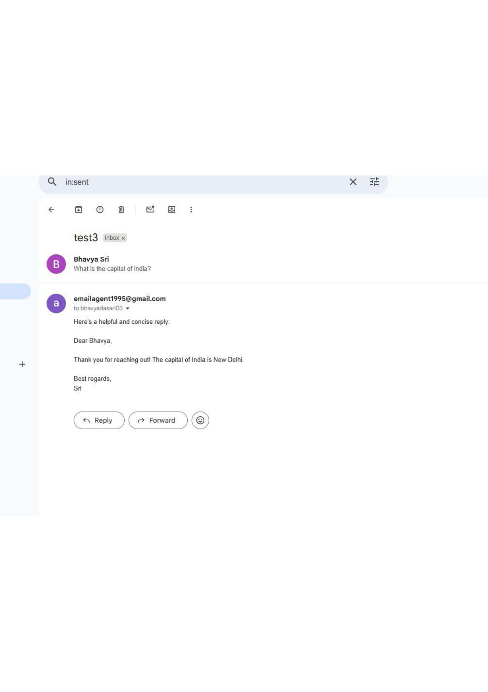
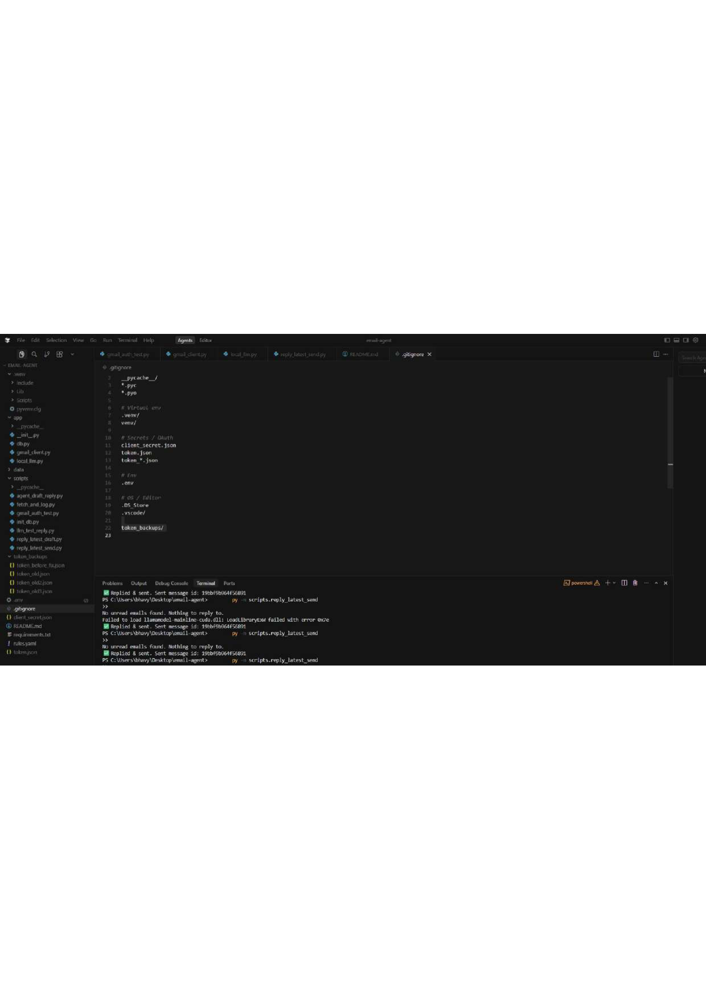

—————# Personal Email Agent (Gmail + Local LLM)

- AI-powered personal email assistant connected to Gmail using OAuth (no passwords)
- Reads unread inbox emails and generates an automatic reply
- Sends reply using Gmail API and marks original email as read
- Uses a local LLM (GPT4All) to generate the reply text (no OpenAI cost)

## Features
- Gmail OAuth authentication (token saved locally)
- Fetch latest unread email (excluding emails from self)
- Generate reply using local LLM
- Reply in the same email thread (In-Reply-To + References + threadId)
- Mark email as read after reply
- Safe by default: runs only when script is executed

## Project Structure
- `app/gmail_client.py` : Gmail OAuth + service creation
- `app/local_llm.py` : Local LLM reply generation (GPT4All)
- `scripts/gmail_auth_test.py` : Verify Gmail connection and basic counts
- `scripts/reply_latest_send.py` : Replies to latest unread email and sends

## Setup (Windows)
- Create and activate virtual environment
  - `py -m venv .venv`
  - `.venv\Scripts\activate`

- Install dependencies
  - `pip install -r requirements.txt`

- Add Google OAuth file
  - Place `client_secret.json` in project root (NOT committed to GitHub)

- Run Gmail auth test
  - `py -m scripts.gmail_auth_test`

## Run (manual trigger)
- Reply to the latest unread email
  - `py -m scripts.reply_latest_send`

## Automation (optional)
- This project replies when you run the script
- For automatic background replies, run it on a schedule (Task Scheduler / cron)
  - Example: run every 1 minute or every 5 minutes

## Notes / Security
- `client_secret.json` and `token.json` are NOT included in GitHub for security
- OAuth token is generated locally after you authorize Gmail
- The agent uses Gmail API scopes required for sending and marking as read:
  - `https://www.googleapis.com/auth/gmail.modify`

## Demo
- Send an email to the connected Gmail inbox
- Run `py -m scripts.reply_latest_send`
- Check Sent Mail for the reply and Inbox for marked-as-read behavior

## Demo Screenshots

**Inbox overview** - unread emails processed by the agent, with auto-generated replies visible in the thread previews.

**Auto-reply example (TEST2 thread)** - the agent reads an incoming message and drafts a contextual reply.

**Auto-reply example (Doubt thread)** - a real question answered automatically by the agent.

**Auto-reply example (test3 thread)** - another example of an automatic, context-aware reply.

**Terminal output** - the agent running locally, confirming a reply was drafted and sent successfully.

